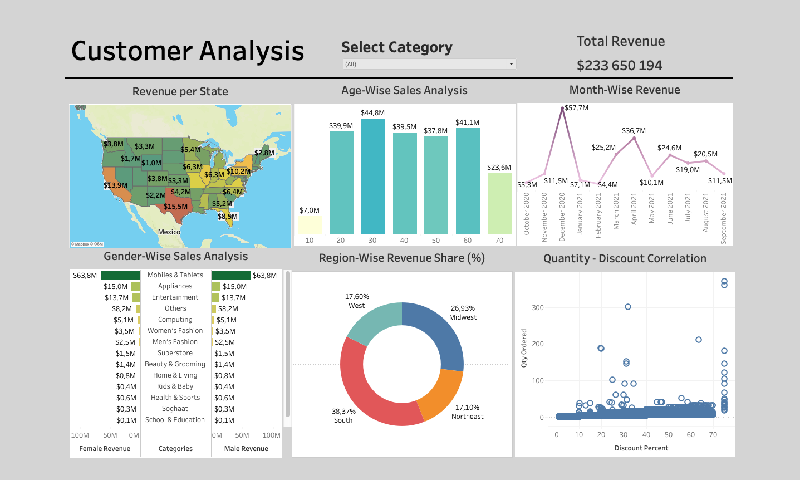

# Dashboard using Tableau

This repository contains two dashboards created with Tableau.
Created Dashboards are used to analyse, visualize and exctract meaningful insights from the data.

## Project 1
#### Customer Sales Analysis

* Dataset link 

## Project 2
#### Airline Analysis for San Francisco (SAF)

* Dataset link 


## Clone this repository

```bash
> git clone https://github.com/anahitxachatryan/Face-similarity-recognition.git
```
